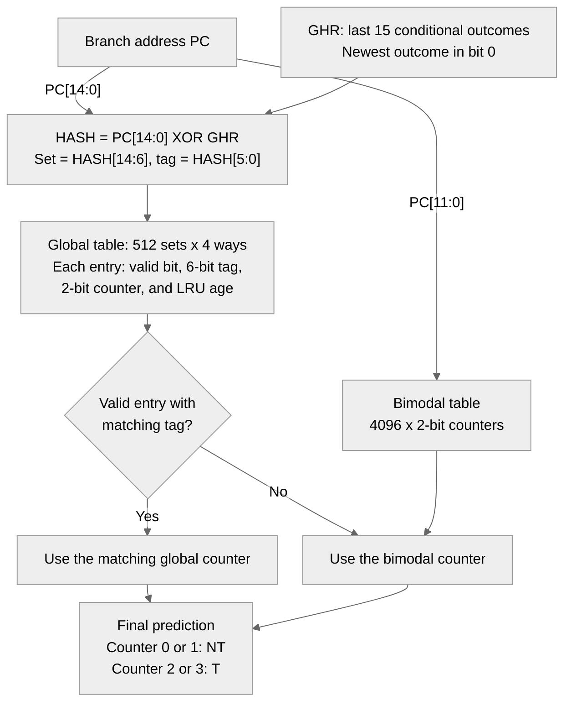

# Report: Pentium M hybrid branch direction predictor

## TL;DR

We built a branch direction predictor in the CBP2 framework. It predicts whether a branch
will be taken or not taken. It combines two tables: bimodal and global. When the global
table has a matching entry, we use its prediction. Otherwise, we use the bimodal prediction.

The code matches all 22 rows of the assignment's worked example, including the table states.
On the 20 course traces, our main model has an average of **7.758 MPKI**. Lower is better.
The bimodal table alone gives 10.267 MPKI. Always predicting taken gives 86.311 MPKI.
The main model needs about **3.75 KiB of hardware state** if its fields are packed into bits.
The C++ program uses more memory because it stores the fields in byte arrays.
These results measure prediction errors. They do not measure CPU speed or power use.

## Contents

- [1. What was built](#1-what-was-built)
- [2. Parameters and storage](#2-parameters-and-storage)
- [3. Prediction and update rules](#3-prediction-and-update-rules)
- [4. Verification](#4-verification)
- [5. Results](#5-results)
- [6. Analysis](#6-analysis)
- [7. Omissions and deviations](#7-omissions-and-deviations)
- [8. References and reused code](#8-references-and-reused-code)

Build and run instructions are in [README.md](README.md). All trace measurements below come from the
files in [`results/`](branch-prediction/cbp2-infrastructure-v2/results/); the result tables were
printed by [`report_tables.py`](branch-prediction/cbp2-infrastructure-v2/report_tables.py).
Page numbers ("PDF page 2", "appendix") refer to the assignment handout
(`programming-branch-predictor.pdf`, 11 pages), which is not included in this repository.

## 1. What was built

The code is in [`pm_predictor`](branch-prediction/cbp2-infrastructure-v2/src/my_predictor.h#L107).
A conditional branch chooses whether to jump based on a condition. Our predictor makes
that choice before it sees the true result.

The bimodal table uses the branch address, called PC. It learns whether branches at that
table entry tend to be taken. The global table also uses the recent results of conditional
branches. We keep those results in the global history register, called GHR.

The global table has 512 groups, called sets. Each set has four entries, called ways.
Each entry has a tag, which is a short value used to check for a match. An entry must be
valid and have the right tag to count as a hit. A hit means a match was found; it does not
mean the prediction is correct. The diagram shows how the two tables work together:



In the diagram, `PC[11:0]` means the lowest 12 bits of the address. Each 2-bit counter
holds one of four values: 0, 1, 2, or 3. Values 0 and 1 predict not taken. Values 2 and 3
predict taken. After the true result is known, taken adds 1 and not taken subtracts 1.
The value stays within 0 to 3. We also fill a global entry on a miss and add the result
to the GHR. Section 3 gives the full update rules.

Not built: the loop predictor, the path information register (PIR) and its hash, and branch
target prediction, which the assignment allows to skip (PDF page 2); see section 7. No
third-party cache code was used: the global table is a set of plain two-dimensional arrays.

## 2. Parameters and storage

We set the sizes when we compile the code. The settings are `PM_BIM_BITS`, `PM_PC_SHIFT`,
`PM_SET_BITS`, `PM_TAG_BITS`, `PM_WAYS`, `PM_HIST_BITS`, and `PM_CTR_INIT`.
The default settings are the main model. The worked-example test uses the same code with
smaller tables (section 4).

| Parameter | Main configuration | Worked example (golden test) | Source |
|---|---|---|---|
| Bimodal table | 4096 counters, index PC[11:0] | 16 counters, index PC[5:2] | PDF p. 2 and p. 6 figures; appendix p. 5-6 |
| Global table | 512 sets × 4 ways | 4 sets × 2 ways | p. 2 and p. 6 figures; appendix |
| Global entry | valid bit, 6-bit tag, 2-bit counter | valid bit, 2-bit tag, 2-bit counter | figures; appendix |
| Hash | HASH = PC[14:0] xor GHR, 15 bits | PC[5:2] xor GHR, 4 bits | **our choice** (GHR in place of the PIR); appendix |
| Set / tag | set = HASH[14:6], tag = HASH[5:0] | set = HASH[3:2], tag = HASH[1:0] | p. 2 and p. 6 figures; appendix |
| Global history (GHR) | 15 bits | 4 bits | **our choice**; appendix |
| Replacement | LRU | LRU | appendix (pages 10-11) |
| Counter start values | all counters 2 (weakly taken) | bimodal entry i: i mod 4; global set s: way 0 = s, way 1 = 3 − s | **our choice**; appendix |

Notes on the choices:

- **15-bit hash and history.** A hash combines the address and history into one value.
  We use XOR: each output bit is 1 when the two input bits differ. The page 2 figure uses
  15 address bits and a 15-bit PIR. It takes set = HASH[14:6] and tag = HASH[5:0].
  The page 6 figure still uses bit 14, but labels its history as only 14 bits.
  We use 15 bits for both inputs, so history can affect every bit of the hash.
  The ISPASS paper also reports a 15-bit PIR and the same set/tag bit split
  (Sections 4.1 and 6.3).
- **GHR instead of PIR.** The real Pentium M keeps path information in the PIR.
  It uses address bits from taken conditional branches and indirect branches.
  The assignment lets us skip this part (PDF page 2). We follow the worked example
  and keep only the taken / not taken results of conditional branches.
- **No address shift.** The page 2 figure uses IP[11:0] for the bimodal index.
  We keep these low bits because x86 instructions can start at any byte address.
  The small worked example instead uses PC[5:2] with 8-bit addresses.
- **4 ways.** We use the four ways shown in the figures. The assignment also allows
  two ways. We test that option by changing `PM_WAYS` (R2).
- **Counter start value 2.** All counters start at 2, which predicts taken.
  Starting at 1 changes the average by only 0.002 MPKI in our tests (section 6.4).

The table below estimates the **hardware storage budget**. It counts the bits needed
for each field. LRU means least recently used: when we need space, we replace the entry
that has gone the longest without a use. We track this order with one age per way.
Each age needs `log2(ways)` bits for the two-way and four-way models used here.

| Structure | 4-way (R1), bits | 2-way (R2), bits |
|---|---:|---:|
| Bimodal: 4096 × 2 | 8,192 | 8,192 |
| Global: 512 × ways × (1 valid + 6 tag + 2 counter) | 18,432 | 9,216 |
| LRU ages: 512 × ways × log2(ways) | 4,096 | 1,024 |
| GHR | 15 | 15 |
| **Total** | **30,735 (3.75 KiB)** | **18,447 (2.25 KiB)** |

These totals are not the memory used by the C++ objects. The code stores each counter,
tag, valid bit, and age in an `unsigned char`. The default model's arrays therefore use
12,288 bytes. On our x86-64 build, `sizeof(pm_predictor)` is 12,328 bytes, including
history, the saved prediction fields, and object overhead. This build has `PM_STATS` off.

For comparison, the framework's sample gshare (B2) has 32,768 2-bit counters and a
15-bit history. Its hardware budget is 65,551 bits (8.0 KiB), or 2.13 times R1.
All storage comparisons below use this hardware bit count.

## 3. Prediction and update rules

The source column separates three kinds of rules. **PDF** means the text or figure states
the rule. **Appendix** means we read the rule from the worked example and checked its
table states. **Our choice** means the assignment leaves that detail open.

| # | Rule | Source |
|---|---|---|
| R1 | Only conditional branches use or update the tables and GHR. Other branches are predicted taken and leave these fields unchanged. The driver scores only conditional branches. | **Our choice**, also used by the sample gshare. The ISPASS paper reports that unconditional branches get no entry in the Pentium M bimodal or global predictor (Section 6.4). |
| R2 | A global hit needs a valid entry with the same tag in the chosen set. On a hit, use that entry's counter. On a miss, use the bimodal counter. | **PDF**: page 5 states that a global hit selects the global prediction. The page 6 figure shows the same rule. |
| R3 | Update the bimodal counter after every conditional branch. Do this even when the global table supplied the final prediction. | **Appendix**: row 6 is a global hit. On page 9, bimodal counter 1 still changes from 1 in row 6 to 2 in row 7. |
| R4 | On a global hit, update the matching counter. Mark that entry as the most recently used. | **Appendix**: row 14 hits way 0 of set 0. On page 11, its counter changes from 1 to 0. The LRU bits change from (1, 0) to (0, 1). |
| R5 | On every global miss, select the least recently used entry. Set its valid bit to 1, write the new tag, and mark it as most recently used. Do this even if the bimodal prediction was correct. | **Appendix**: rows 7 and 17 are misses with correct bimodal predictions. Rows 8 and 18 show the new entry: set 1, tag 11. |
| R6 | Keep the selected entry's old counter value. Then update that counter using the true result. Do not reset it when writing a new tag. | **Appendix**: row 8 replaces way 0 of set 1. Its counter is 2. After the not-taken result, row 9 shows 1. |
| R7 | After the tables are trained, GHR = ((GHR << 1) \| outcome) & (2^L − 1), with L = 15 (4 in the example). | **Appendix**: GHR column (Col-4) of page 8, all 22 rows. |
| R8 | Set the initial ages so that each empty set fills ways 0, 1, 2, 3 in order. | **Appendix**: page 10, row 1 starts with way 0 as the least recently used way in each two-way set. |

R5 and R6 follow the worked example. Other designs might create an entry only after a
wrong prediction, or reset its counter to a weak state. We did not test those choices.
The assignment text does not give these details. We also did not find a rule for when to
create global entries in the ISPASS paper.

`predict()` saves the bimodal index, global set, tag, and hit way in `pm_update`.
`update()` uses those saved values to train the entries used for that prediction.
The driver calls `update()` right after each prediction. The GHR is still unchanged when
`update()` starts. It changes only at the end of `update()`, after the tables are trained.

## 4. Verification

### 4.1 Golden test: the worked example of the appendix

We compile [`src/test_pm.cc`](branch-prediction/cbp2-infrastructure-v2/src/test_pm.cc)
with the small sizes used in the appendix. The test starts with the PDF's initial table
values. It then feeds the first 22 branches of page 7 to the predictor. Their addresses
are b1 = 0x44, b2 = 0x6C, and b3 = 0x90. These are the 22 rows shown on pages 8-11.
For each row, the test checks:

- before the branch: the GHR (page 8), all 16 bimodal counters (page 9), and every field of the
  global table, i.e. valid bit, tag, counter and LRU bit of both ways of all 4 sets (pages
  10-11);
- after `predict()`: the set and tag (page 8 Col-6), global hit or miss and the global
  prediction (Col-7), and the final prediction (Col-8).

We copied the expected values from PDF pages 8-11. We also checked that the shared fields
agree across those pages. The test prints:

```text
appendix replay (PDF pages 7-11)
  row br  outcome GHR  set tag global final  result
    1 b1  T       0000   0  01  miss   NT     ok
    2 b3  T       0001   1  01  miss   NT     ok
  ...
    6 b1  T       1001   2  00  hit T  T      ok
  ...
   14 b2  NT      1010   0  01  hit NT NT     ok
  ...
   22 b3  T       0011   1  11  miss   T      ok
  22/22 rows match the PDF
```

On a global miss, Col-6 on pages 10-11 shows the prediction of the entry about to be
replaced. That is not the final prediction. For example, row 22 shows NT there, but the
final prediction is T. The test reads the final prediction from Col-8 on page 8.

### 4.2 Counter, LRU, and branch checks

We run these checks with both the small model and the default four-way model:

- **Other branch types.** They are predicted taken. The tables and GHR stay unchanged (R1).
- **Counter limits.** At 0, a not-taken result leaves the counter at 0. At 3, a taken
  result leaves it at 3. We check both tables through `predict()` and `update()`.
- **LRU order.** An empty set fills ways 0 through W−1 in order, where W is the number
  of ways. Way 0 should then be replaced next. After using way 0 again, way 1 should be
  replaced next. Each age from 0 to W−1 must appear exactly once in the set.
- **LRU in a full prediction.** We fill one set with W tags, use the first tag again,
  and add a new tag. Only the second tag should be replaced.

Both builds print `all checks passed`.

### 4.3 The test detects wrong rules

Passing a test is more useful if the test can also catch mistakes.
[`mutants_test_pm.py`](branch-prediction/cbp2-infrastructure-v2/mutants_test_pm.py)
changes one rule at a time in a temporary copy of the predictor. It then runs the test
on that copy. All eight wrong versions fail:

| Broken rule | Appendix rows that still match | Other failed checks | test_pm exit code |
|---|---:|---:|---:|
| R3: bimodal not trained on global hits | 9/22 | 0 | 1 |
| R4: hit way not made most recently used | 14/22 | 2 | 1 |
| R5: allocate only when the prediction was wrong | 7/22 | 3 | 1 |
| R6: counter reset to 2 on allocation | 1/22 | 0 | 1 |
| R7: history shifted the wrong way | 1/22 | 0 | 1 |
| R8: way 1 replaced first in an empty set | 22/22 | 4 | 1 |
| R2: bimodal used even on a global hit | 17/22 | 0 | 1 |
| set and tag fields swapped | 0/22 | 2 | 1 |

The wrong R8 version still matches the 22 appendix rows. That test loads its own initial
LRU state from the PDF, so it cannot catch a wrong default age order. The separate LRU
checks catch this mistake.

### 4.4 Consistency of the trace runs

- Running `src/predict` on single traces (164.gzip, 256.bzip2, 300.twolf) prints the same
  values as the corresponding lines of `run`.
- We repeated all ten prediction runs and both diagnostic runs. All 12 result files
  matched the saved files byte for byte.
- The `-DPM_STATS` builds print the same MPKI as R1 and R2 on every trace, and their
  misprediction counts reproduce those values.
- B1 and pm update the bimodal table in the same way (R3). We can therefore count B1's
  errors from the pm run: add the errors on global misses to the errors the bimodal
  table would make on global hits. `report_tables.py` checks this against B1 for all
  20 traces and both global table sizes. All values match.

## 5. Results

The compiler settings are in [README.md](README.md#all-configurations-of-the-report).
We compare five models:

- **B0:** the original skeleton. It always predicts taken.
- **B1:** our predictor with only the bimodal table.
- **B2:** the framework's sample gshare. It combines address and history to look up a
  single counter table. Its hardware storage budget is 2.13 times R1's.
- **R1:** our main model, with a four-way global table.
- **R2:** the same model with a two-way global table.

MPKI means wrong conditional-branch predictions per 1000 instructions. The driver uses
100 million instructions for every trace:

```text
MPKI = 1000 × wrong conditional-branch predictions / 100,000,000
```

The denominator counts all instructions, not just branches. MPKI is not an error percentage.
Each trace uses the same denominator. A reduction in average MPKI therefore gives the
same relative reduction in total errors, apart from rounding. The column "R1 vs B1"
uses `(R1 − B1) / B1 × 100%` for each row. A negative value means R1 has fewer errors.

### Table 1: MPKI per trace

| Trace | B0 always taken | B1 bimodal only | B2 gshare (sample) | **R1 pm 4-way** | R2 pm 2-way | R1 vs B1 |
|---|---:|---:|---:|---:|---:|---:|
| 164.gzip | 70.025 | 15.031 | 12.473 | **12.692** | 12.951 | -15.6% |
| 175.vpr | 85.312 | 14.673 | 13.415 | **15.967** | 16.823 | +8.8% |
| 176.gcc | 86.071 | 19.313 | 11.254 | **17.999** | 19.786 | -6.8% |
| 181.mcf | 102.497 | 33.271 | 15.837 | **18.269** | 20.081 | -45.1% |
| 186.crafty | 48.651 | 13.097 | 5.837 | **9.105** | 10.818 | -30.5% |
| 197.parser | 78.421 | 15.420 | 10.008 | **10.933** | 12.615 | -29.1% |
| 201.compress | 76.983 | 9.368 | 7.831 | **8.017** | 8.635 | -14.4% |
| 202.jess | 92.343 | 8.773 | 1.562 | **2.000** | 2.554 | -77.2% |
| 205.raytrace | 109.506 | 3.704 | 2.756 | **3.597** | 4.025 | -2.9% |
| 209.db | 91.451 | 6.437 | 3.909 | **4.824** | 5.268 | -25.1% |
| 213.javac | 109.644 | 3.198 | 2.267 | **3.008** | 3.305 | -5.9% |
| 222.mpegaudio | 110.339 | 3.166 | 2.188 | **2.940** | 3.264 | -7.1% |
| 227.mtrt | 112.022 | 3.682 | 2.657 | **3.436** | 3.886 | -6.7% |
| 228.jack | 77.958 | 7.175 | 3.033 | **4.238** | 5.669 | -40.9% |
| 252.eon | 24.226 | 9.443 | 1.807 | **2.148** | 3.838 | -77.3% |
| 253.perlbmk | 66.833 | 5.848 | 2.554 | **5.084** | 7.315 | -13.1% |
| 254.gap | 75.950 | 9.760 | 3.926 | **4.333** | 5.762 | -55.6% |
| 255.vortex | 70.524 | 1.930 | 1.222 | **1.641** | 2.239 | -15.0% |
| 256.bzip2 | 178.257 | 0.113 | 0.094 | **0.112** | 0.146 | -0.9% |
| 300.twolf | 59.221 | 21.943 | 21.489 | **24.817** | 24.239 | +13.1% |
| **average** | 86.311 | 10.267 | 6.305 | **7.758** | 8.660 | -24.4% |

### Table 2: global hits and accuracy (from the `-DPM_STATS` builds)

The rates in this table use these counts:

- **Global hit rate:** global hits / conditional branches.
- **Accuracy on hits, global / bimodal:** two separate accuracy values on the same set
  of global hits. Each uses global hits as its denominator. The first counts correct
  global predictions. The second counts correct bimodal predictions. On a hit, pm uses
  only the global prediction.
- **Accuracy on misses:** correct bimodal predictions on global misses / global misses.

All rates are shown as percentages. The last row adds the counts across all 20 traces
before computing each rate.

| Trace | conditional branches | 4-way: global hit rate | 4-way: accuracy on hits, global / bimodal | 4-way: accuracy on misses (bimodal) | 2-way: global hit rate | 2-way: accuracy on hits, global / bimodal |
|---|---:|---:|---:|---:|---:|---:|
| 164.gzip | 15114596 | 91.6% | 92.62% / 90.93% | 80.45% | 83.1% | 93.05% / 91.39% |
| 175.vpr | 12827221 | 71.7% | 88.03% / 89.44% | 86.33% | 56.1% | 86.84% / 89.82% |
| 176.gcc | 17083242 | 70.9% | 91.21% / 90.12% | 85.22% | 54.4% | 90.46% / 90.96% |
| 181.mcf | 21700420 | 85.3% | 93.68% / 85.58% | 79.38% | 77.4% | 93.62% / 85.77% |
| 186.crafty | 8927032 | 73.7% | 92.72% / 86.66% | 81.59% | 56.5% | 91.71% / 87.20% |
| 197.parser | 14190746 | 89.4% | 93.69% / 90.15% | 80.54% | 80.1% | 93.39% / 90.92% |
| 201.compress | 11764885 | 97.7% | 93.20% / 92.03% | 92.57% | 87.7% | 92.61% / 91.90% |
| 202.jess | 14154055 | 96.5% | 98.90% / 93.94% | 90.15% | 92.4% | 98.74% / 93.98% |
| 205.raytrace | 12201864 | 84.7% | 97.43% / 97.33% | 94.95% | 62.9% | 97.50% / 97.92% |
| 209.db | 13191770 | 94.4% | 96.75% / 95.45% | 89.47% | 86.7% | 96.68% / 95.66% |
| 213.javac | 12986593 | 92.0% | 97.98% / 97.82% | 94.30% | 61.0% | 97.12% / 97.26% |
| 222.mpegaudio | 13021205 | 92.4% | 97.99% / 97.81% | 94.70% | 61.2% | 97.10% / 97.22% |
| 227.mtrt | 12512685 | 88.3% | 97.60% / 97.37% | 94.67% | 66.7% | 97.65% / 97.89% |
| 228.jack | 11926271 | 91.0% | 96.97% / 94.26% | 91.19% | 75.3% | 95.94% / 94.26% |
| 252.eon | 7724960 | 93.4% | 97.49% / 87.39% | 93.30% | 76.9% | 96.55% / 87.11% |
| 253.perlbmk | 13537118 | 90.6% | 96.68% / 96.06% | 92.02% | 72.9% | 95.44% / 96.92% |
| 254.gap | 13838041 | 96.2% | 97.13% / 93.06% | 90.14% | 87.0% | 96.78% / 93.46% |
| 255.vortex | 11073761 | 95.0% | 98.74% / 98.46% | 94.33% | 84.0% | 98.14% / 98.48% |
| 256.bzip2 | 24586276 | 99.8% | 99.97% / 99.97% | 93.50% | 99.6% | 99.96% / 99.97% |
| 300.twolf | 13098893 | 48.1% | 80.97% / 85.53% | 81.13% | 32.7% | 80.00% / 85.37% |
| **all 20 traces** | 275461634 | 87.5% | 95.59% / 93.51% | 85.85% | 74.0% | 95.32% / 93.74% |

### Table 3: sensitivity of the 4-way configuration (average MPKI over the 20 traces)

| Variant | Flags | average MPKI |
|---|---|---:|
| S_hist8 | `-DPM_HIST_BITS=8` | 9.985 |
| S_hist10 | `-DPM_HIST_BITS=10` | 9.047 |
| S_hist12 | `-DPM_HIST_BITS=12` | 8.486 |
| S_hist14 | `-DPM_HIST_BITS=14` | 7.870 |
| R1_pm_4way | none (15-bit GHR, counters start at 2) | 7.758 |
| S_ctr_init1 | `-DPM_CTR_INIT=1` | 7.756 |

Counter start value 1 instead of 2: per-trace MPKI change from -0.029 to +0.036.

## 6. Analysis

### 6.1 What the global table adds

Adding the global table lowers average MPKI from 10.267 (B1) to 7.758 (R1).
This is a 24.4% drop relative to B1: `(10.267 − 7.758) / 10.267`.
Both models make far fewer errors than always predicting taken (86.311 MPKI).

B1 and R1 update their bimodal tables in the same way (R3 and section 4.4).
They make the same prediction on every global miss. They can differ only on a global hit,
when R1 uses the global counter:

```text
mispredictions(R1) − mispredictions(B1)
    = (hits where the global counter is wrong) − (hits where the bimodal counter is wrong)
```

The global table helps when its counters are more accurate than the bimodal counters
on those hits. This happens on 18 of the 20 traces for R1 (Table 2).

For example, 252.eon has a global hit on 93.4% of its conditional branches.
On those hits, global accuracy is 97.49%, while bimodal accuracy is 87.39%.
Its MPKI falls from 9.443 to 2.148, a 77.3% drop relative to B1.
Other large drops are 77.2% on 202.jess and 55.6% on 254.gap, also relative to B1.
The largest absolute drop is on 181.mcf: 33.271 to 18.269 MPKI.

When both tables are about as accurate on global hits, the gain is small.
On 256.bzip2, both hit accuracies round to 99.97%; MPKI changes from 0.113 to 0.112.
On 205.raytrace, the hit accuracies are 97.43% and 97.33%; MPKI falls by 2.9% relative to B1.

The global table makes two traces worse. Compared with B1, MPKI rises by 8.8% on 175.vpr
and 13.1% on 300.twolf. On their global hits, the global counter is less accurate than
the bimodal counter: 88.03% versus 89.44% for 175.vpr, and 80.97% versus 85.53% for 300.twolf.
The fixed hit rule still selects the global prediction. The added errors amount to
1.295 and 2.874 MPKI, using the unrounded diagnostic counts.

We did not test why these global predictions are worse. One possible cause is frequent
entry replacement: many address/history combinations share only 2048 entries, and a
replaced entry keeps its old counter (R6). This is a possible explanation, not a measured
cause. The low global hit rate on 300.twolf (48.1%) alone does not prove it.

### 6.2 4-way versus 2-way global table

The two-way model (R2) averages 8.660 MPKI. The four-way model reduces this by 10.4%,
using R2 as the baseline: `(8.660 − 7.758) / 8.660`. It uses 1.67 times the hardware
storage (30,735 / 18,447 bits). R1 has fewer errors on 19 of the 20 traces.

With two ways, the global table has half as many entries. Its hit rate over all conditional
branches drops from 87.5% to 74.0%. On 10 of the 20 traces, its global predictions on hits
are less accurate than its bimodal predictions (Table 2). These are the same 10 traces
where R2 has more errors than B1 (Table 1). R2 still has a lower average MPKI than B1
(8.660 versus 10.267), with large gains on 181.mcf, 202.jess, and 252.eon.

The two-way model does better on 300.twolf: 24.239 versus 24.817 MPKI.
For both models, global predictions on hits are worse than bimodal predictions on those
same hits. The two-way model uses global predictions on fewer conditional branches
(32.7% versus 48.1%). The hit counts and the two accuracies in Table 2 together account
for its smaller increase in errors over B1.

### 6.3 Comparison with the sample gshare

The sample gshare (B2) averages 6.305 MPKI and has fewer errors than R1 on all 20 traces.
It also has a larger hardware budget: 65,551 bits, or 2.13 times R1.
We did not test gshare at R1's storage budget. We therefore cannot separate the effect
of its design from the effect of its larger table.

### 6.4 History length and counter start value

Longer history gives lower average MPKI in our tests: 9.985 with 8 bits, 9.047 with 10,
8.486 with 12, 7.870 with 14, and 7.758 with 15. Our hash uses only 15 bits.
Adding history bits above that would not affect this hash.

The best length still depends on the trace. On 9 of the 20 traces, a shorter history
beats 15 bits. For example, 300.twolf gives 23.417 MPKI with 8 bits and 24.817 with 15.

Starting the counters at 1 instead of 2 changes average MPKI from 7.758 to 7.756.
No trace changes by more than 0.036 MPKI.

The two runs read and update the same counters in the same order. The counter values
do not control which entries we select or replace. Each pair of counters starts one
apart and remains at most one apart. Once an update holds one at its limit and brings
the other to that same limit, their values stay equal. We never reset a counter (R6).
There are 6,144 counters: 4,096 bimodal and 2,048 global. Each trace has about 7.7 to
24.6 million conditional branches. The measurements show that the start value has a
small effect on these full trace runs; we did not measure how long each counter takes
to reach the same value.

## 7. Omissions and deviations

- **Optional parts.** We skip the loop predictor, the PIR and its address hash, and target
  prediction, as allowed on PDF page 2. We leave `target_prediction(0)` as in the skeleton.
  We did not implement the extra-credit `cpm_predictor`.
- **History.** We record only conditional branch results (R1). The real Pentium M uses
  path information that also includes indirect branches.
- **History size.** The page 6 figure labels a 14-bit BHR but uses HASH[14:6].
  We chose a 15-bit history and hash (section 2).
- **New global entries.** We follow the appendix's rules for when to create an entry and
  how to update its counter (R5, R6). We did not test other rules.
- **Replacement.** We track the full LRU order with one age per way. The appendix uses LRU.
  The page 2 figure names a different policy, pseudo-LRU, only for the branch target buffer.
- **Timing.** The program updates each branch right after its prediction. It does not
  model a CPU pipeline or update history from guesses about unfinished branches.

## 8. References and reused code

1. Assignment 1: Branch Predictor Implementation, COSC 6385 (handout
   `programming-branch-predictor.pdf`), including the worked example in Appendix B
   (pages 5-11).
2. V. Uzelac and A. Milenković, "Experiment Flows and Microbenchmarks for Reverse Engineering
   of Branch Predictor Structures," IEEE International Symposium on Performance Analysis of
   Systems and Software (ISPASS), 2009.
   <http://www.ece.uah.edu/~milenka/docs/vuam_ispass09.pdf>
3. D. A. Jiménez, CBP2 branch prediction infrastructure (`cbp2-infrastructure-v2`):
   the simulation driver, trace reader, traces, `run` script and the sample `gshare_predictor`,
   used unchanged except for the `PREDICTOR` macro in `predict.cc`.
   <https://people.engr.tamu.edu/djimenez/taco/utsa-www/cs5513/competition/>

No other code was reused. In particular, no C++ cache implementation was used (the assignment
allowed one, e.g. the L1-Cache-Simulator it links to); the 2-bit counter update follows the
style of the sample gshare in the same file.
